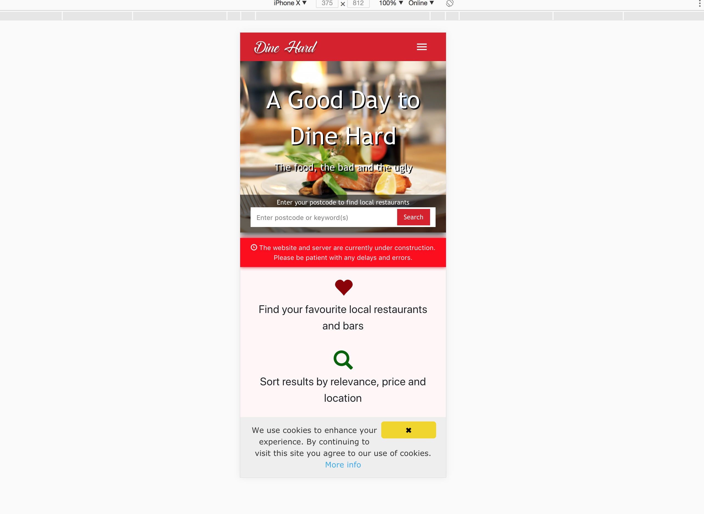

# Restaurant Reviewing Website
This project is a website where people can review restaurants in Sheffield. It is built as a mobile-first progressive web app using NodeJS, express and service workers.



# Install & Run

## Prerequisites

- [Install ```Node```](https://nodejs.org/en/)
- [Install ```npm```](https://www.npmjs.com/)
- [Install ```MongoDB```](https://docs.mongodb.com/manual/installation/)
- ```MongoDB``` instance running on ```'mongodb://localhost/mydb'```
- You should seed the database by modifying and then running the scripts in ```models/seeding/``` by running ```node models/seeding/script_name.js```

## Run

- ```npm install```
- ```node app.js```
- Go to ```http://localhost:3000/```
